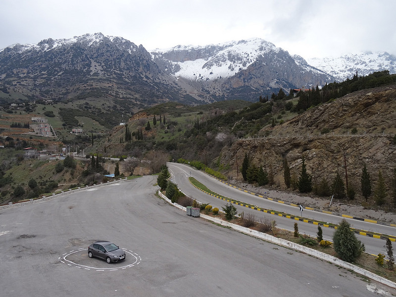
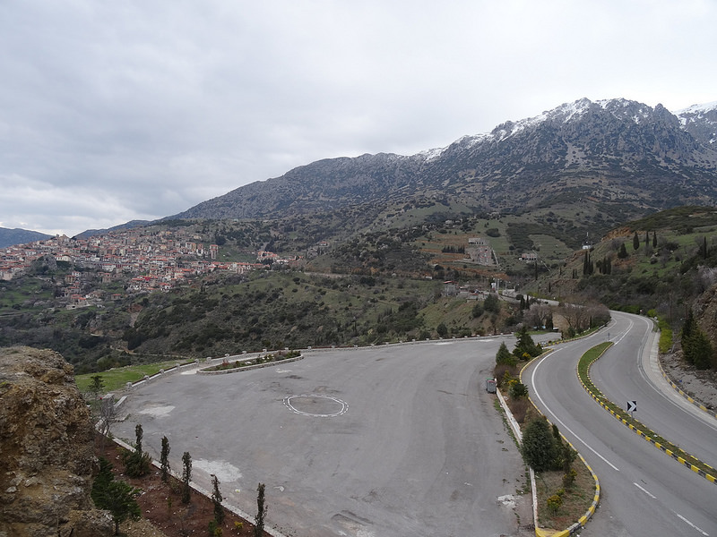

# 材料一：Autonomous Trap 001

用于新作品分析测试。以下是已核对的基础材料，不包含成稿或指定结论。

## 作品与材料来源

- James Bridle，Autonomous Trap 001，2017。
- 艺术家官网记载：在帕纳索斯山实施盐圈行为，日期为2017年3月14日；项目以地面标记和交通符号构成车辆陷阱。
- ZKM将馆藏对象列为行为记录的档案颜料印相。其150×200厘米指馆藏印相，不是盐圈尺寸。
- ZKM说明，作品与艺术家制作自己的自动驾驶汽车的项目相关。照片所呈现的盐圈结合实线与虚线。
- ZKM对作品的说明同时涉及抵抗与人和机器共享空间的讨论；这是机构的阐释，不能直接变成艺术家原话。

以上材料不足以还原完整车辆代码、所有测试条件或各商业自动驾驶系统的表现。艺术家官网这页没有提供完整的社会伦理宣言。

## 原图

图1：车辆位于盐圈内，外围是空地、道路与山景。James Bridle，Autonomous Trap 001，2017。来源：艺术家官网，© James Bridle。

图2：另一视角的盐圈与场地，此图中圈内没有车辆。来自同一项目页，不把它当成图1的局部裁切或另一件作品。© James Bridle。

两图已逐张查看，未编辑；下载地址、来源页和文件指纹见 images-manifest.json。照片不是车辆连续运行的视频记录。

## 一手网页（2026-10-05访问）

- [艺术家项目页](https://jamesbridle.com/works/autonomous-trap-001)：作品名称、年份、行为日期与原图。
- [ZKM作品记录](https://zkm.de/en/artwork/autonomous-trap-001)：馆藏媒介、尺寸与机构说明。

本材料只简要转述，没有复制完整网页。
