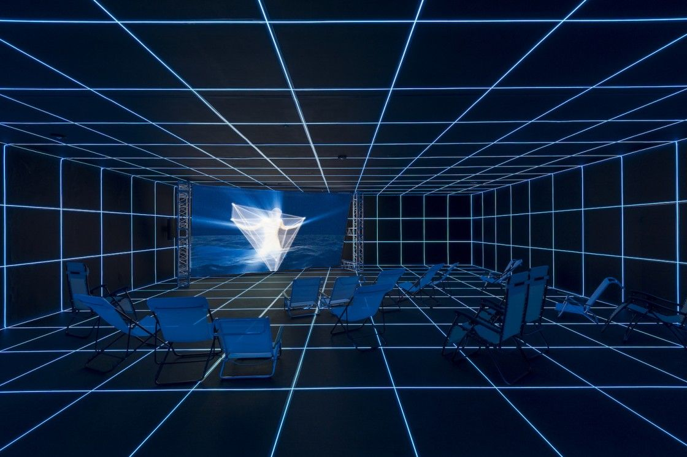
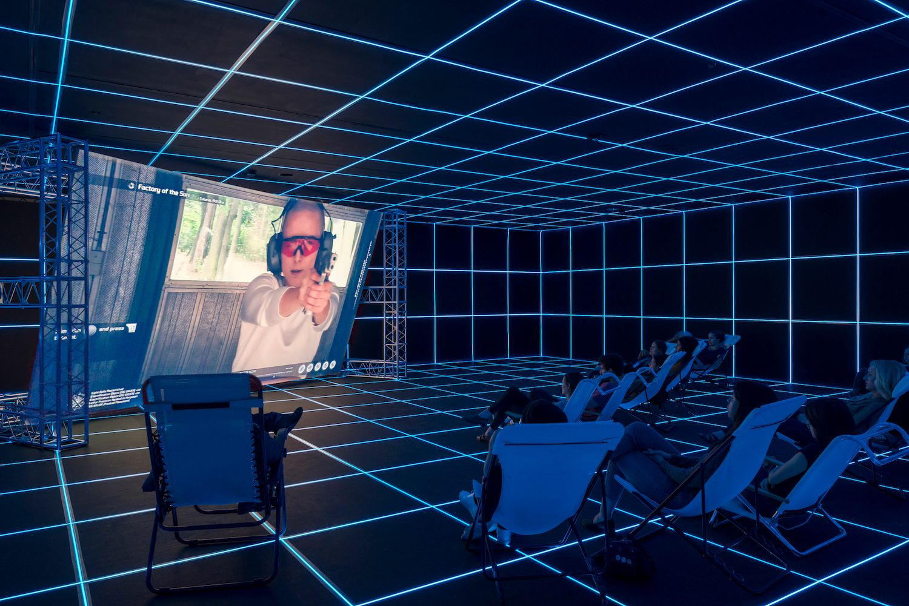

# 材料二：Factory of the Sun

用于新作品分析测试。以下是已核对的基础材料，不包含成稿或指定结论。

## 作品与材料来源

- Hito Steyerl，Factory of the Sun，2015。作品在2015年威尼斯双年展德国馆首次展出。
- MOCA介绍它是一件沉浸式影像装置，混合新闻报道、纪录片、电子游戏和网络舞蹈视频等影像形式。
- MOCA的作品说明涉及影像流通的愉悦、风险及日常监控；这些是机构介绍，当前材料没有艺术家第一人称访谈。
- 新加坡美术馆说明，影片蒙太奇包含网络舞蹈、无人机监控画面、电子游戏、虚构新闻及学生抗议记录，展厅发光网格把画面与物理空间相连。
- 片中讲述劳动者被迫通过动作捕捉来产生人工阳光的超现实故事。这是影片叙事，不是现实的发电技术说明。

机构展览日期与作品年份分开：MOCA图注对应2016年展览；新加坡美术馆页面对应2023年展览；作品年份仍为2015。

## 原图

图1：MOCA展厅视图，发光网格覆盖空间，投影位于前方，躺椅朝向屏幕。

图2：同次MOCA展览的另一视角，有观众坐在躺椅上，屏幕呈现影片中的画面。不是另一件作品。

两图完整来源署名：Installation view of Hito Steyerl: Factory of the Sun, February 21–September 12, 2016 at MOCA Grand Avenue. Courtesy of The Museum of Contemporary Art, Los Angeles. Photo by Justin Lubliner and Carter Seddon.

两图已逐张查看，未编辑；下载地址、来源页和文件指纹见 images-manifest.json。仅看展厅照片无法确认影片每个镜头或整段剪辑节奏。

## 一手机构网页（2026-10-05访问）

- [MOCA展览页](https://www.moca.org/exhibitions/hito-steyerl-factory-of-the-sun)：作品介绍、2016年展览与原图署名。
- [新加坡美术馆展览及作品记录](https://www.singaporeartmuseum.sg/Art-Events/Exhibitions/Hito-Factory-of-the-Sun)：2015年作品年份、媒介组合与空间介绍。

本材料只简要转述，没有复制完整网页。
